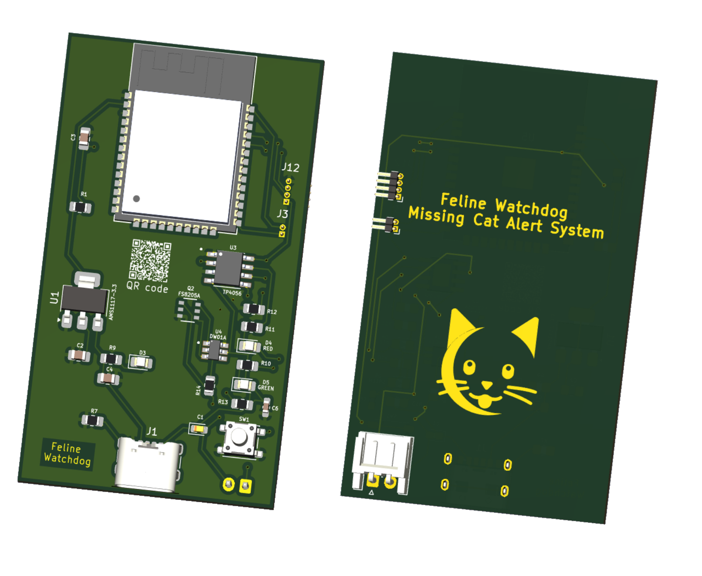
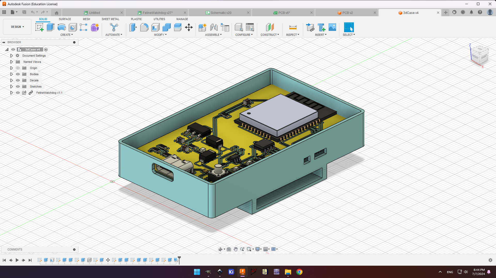
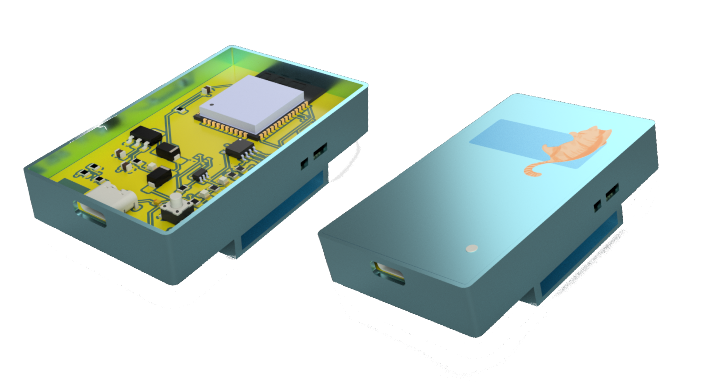

# 🐱 Feline Watchdog: Missing Cat Alert System


Feline Watchdog is an ESP32-based system designed to monitor the Wi-Fi connection between your cat's collar-mounted ESP32 device and your home network. If the Wi-Fi connection is lost, indicating that your cat may have wandered out of range, the system sends a notification to your iOS or Android device using the ntfy Linux tool.

## Overview

Have you ever worried about your cat wandering too far from home? Feline Watchdog provides peace of mind by alerting you when your cat goes missing. By monitoring the Wi-Fi connection between your cat's collar-mounted ESP32 device and your home network, Feline Watchdog can detect when your cat is out of range and send you an alert notification on your mobile device.

## 🔧 Prerequisites

- ESP32 microcontroller
- Raspberry Pi (Optional)
- Docker (if using Raspberry Pi)
- Router (if not using Raspberry Pi)

## Embedded System Configuration


<p align="center">
  <b>Two implementations of Embedded System Configuration</b>
</p>

### Option 1: With Raspberry Pi

1. **Setup Wi-Fi Hotspot on Raspberry Pi**
   - Use the provided bash script using the **nmcli** tool to create a Wi-Fi hotspot on the Raspberry Pi. 
    ```bash
    bash create_hotspot.sh
    ```
    or
    ```bash
    ./create_hotspot.sh
    ```
  2. **Install Docker on your Raspberry Pi**
  ```bash
  sudo docker --version
  Docker version 20.10.21, build 20.10.21-0ubuntu1~18.04.3
  ```
  ```bash
  docker run \
    -v /var/cache/ntfy:/var/cache/ntfy \
    -v /etc/ntfy:/etc/ntfy \
    -p 80:80 \
    -itd \
    binwiederhier/ntfy \
      serve \
      --cache-file /var/cache/ntfy/cache.db
  ```
## 📡 ESP32 Configuration and Notification Setup

### Option 1: Using Raspberry Pi as a Wi-Fi Hotspot

1. **ESP32 Configuration**
   - Upload the `cat.ino` code to your ESP32.
   - The ESP32 will connect to the Wi-Fi hotspot created by the Raspberry Pi.
   - Once connected, the assigned IP address will be printed to the serial monitor.

2. **Raspberry Pi Monitoring and Notification**
   - The Raspberry Pi continuously monitors the connection status of the ESP32.
   - If the connection is lost, it triggers a notification using ntfy.

### Option 2: Direct Connection to Router

For a basic example of using NTFY with ESP boards, check out the [ntfy_on_a_chip repository](https://github.com/gergepalfi/ntfy_on_a_chip). It provides a foundational setup for communicating with the NTFY server and can be adapted for various projects, including the [Feline Watchdog](https://github.com/YourUsername/FelineWatchdog).


1. **Connect ESP32 Directly to Router**
   - Configure your ESP32 to connect directly to your home Wi-Fi network (router).

2. **ESP32 Configuration**
   - Upload the `cat.ino` code to your ESP32.
   - The ESP32 will connect to the specified Wi-Fi network and print the assigned IP address to the serial monitor.

3. **Notification Setup**
   - Set up ntfy or another notification service on a server or computer within your home network.
   - This service will monitor the connection status of the ESP32.
   - If the connection is lost, it triggers a notification using ntfy or a similar service.

### Notes
- Ensure that your network's firewall settings allow communication between the ESP32 and the notification service.
- Configure ntfy or your chosen notification service according to the service's documentation for optimal performance.


## 🔩 PCB Design


  ### Dual Power Sources: Li-ion Battery and USB

  This setup allows the ESP32 to be powered either by a Li-ion battery or directly from a USB source via a voltage regulator.

  ### Li-ion Battery Connection
  - The Li-ion battery is connected to the **BATT+** and **BATT-** terminals of the charger module.
  - **BATT+** from the charger module is connected to the 3.3V input of the ESP32 through a Schottky diode.
  - **BATT-** is connected to the GND of the ESP32.

  ### USB Power Connection (For Re-programming)
  - The 5V line from the USB is connected to the **VIN** of the voltage regulator.
  - **GND** from the USB is connected to the GND of the voltage regulator.
  - The 3.3V output of the voltage regulator is connected to the 3.3V input of the ESP32 through a Schottky diode.

  

  Screenshots from KiCad:

  

  Screenshots from Fusion 360:


  ### Important Notes
  - Schottky diodes are used to prevent backfeeding between the battery and USB power sources.

  ## 🏗️ 3D Design

  Screenshots from Fusion 360:
  


  ## 3D Printed Case

  Screenshots of the printed 3D case:
  


  ## To Do

  - [x] Implement notification functionality using ntfy for sending alerts to iOS or Android devices.
  - [x] Implementation without a middle point such as Raspberry Pi, but directly with a router and ESP32.
  - [ ] Lower power consumption.
  - [ ] Implement HTTP communication method for sending alerts to a designated endpoint.
  - [ ] Implement MQTT communication method for publishing messages to a specific topic on an MQTT broker.
  - [ ] Ensure seamless integration of these functionalities within a Docker container on the Raspberry Pi.
  - [ ] Document setup and configuration steps for each notification method.
  - [ ] Test and validate the system's functionality across different scenarios.
  - [ ] Gather feedback and suggestions from users for further enhancements.


  ## 🧑‍💻 Authors

  - [](https://github.com/k-antoniou)


  - [](https://github.com/Paschalis)


  ## 👥 Contributors
  -
  -
  -


  Contributions are welcome! Feel free to submit pull requests or open issues if you encounter any problems.


   ## 🙏 Acknowledgements

   - A special thanks to the [ntfy_on_a_chip](https://github.com/gergepalfi/ntfy_on_a_chip) repository by Gergely Palfi. The example code and documentation provided were instrumental in implementing the direct connection option for the Feline Watchdog project. The guidance on using NTFY with ESP boards and the detailed explanation of HTTPS communication enabled us to streamline our setup by connecting the ESP32 directly to a router without needing an intermediate server like a Raspberry Pi. Your work greatly facilitated our development process and contributed to the success of the Feline Watchdog system. Thank you!

   - We would also like to acknowledge the creators of the [ntfy](https://ntfy.sh) app. The app’s simplicity and functionality made it easy to send and receive notifications, which is a core feature of the Feline Watchdog system. The ability to integrate it seamlessly into our project greatly enhanced its effectiveness.

   ## 📜 License

  This project is licensed under the MIT License - see the [LICENSE](LICENSE) file for details.
  
   - [](https://opensource.org/licenses/MIT)

**Thank you for visiting FelineWatchdog!** ✨


