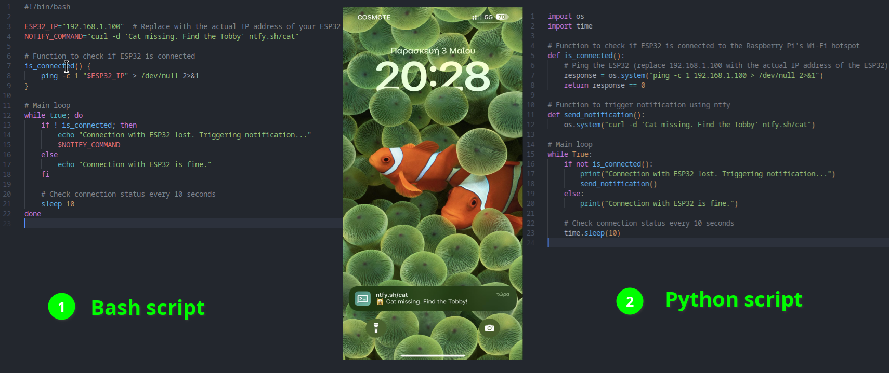

# 🐱 Feline Watchdog: Missing Cat Alert System


Feline Watchdog is an ESP32-based system designed to monitor the Wi-Fi connection between your cat's collar-mounted ESP32 device and a Raspberry Pi. If the Wi-Fi connection is lost, indicating that your cat may have wandered out of range, the system sends a notification to your iOS or Android device using the ntfy Linux tool running in a Docker container on the Raspberry Pi.

## Overview

Have you ever worried about your cat wandering too far from home? Feline Watchdog provides peace of mind by alerting you when your cat goes missing. By monitoring the Wi-Fi connection between your cat's collar-mounted ESP32 device and your Raspberry Pi, Feline Watchdog can detect when your cat is out of range and send you an alert notification on your mobile device.

## 🔧 Prerequisites

- ESP32 microcontroller
- Raspberry Pi
- Docker installed on Raspberry Pi

## Installation
1. To create a Wi-Fi hotspot on your Raspberry Pi, there are three ways. You can either follow the [instructions](WiFi_hotspot.md), or for a simpler method, you can use the provided bash script using **nmcli** tool. First, make sure to connect your Raspberry Pi to the internet. Then, execute the script using the following commands:
   ```bash
   chmod +x myscript.sh
   ```
   ```bash
   bash create_hotspot.sh
   ```
   or
   ```bash
   ./create_hotspot.sh
   ```
1. Connect your ESP32 to your Raspberry Pi via Wi-Fi.
2. Install the Docker on your Raspberry Pi if not already installed. 
```bash
sudo docker --version
Docker version 20.10.21, build 20.10.21-0ubuntu1~18.04.3
```
```bash
docker run \
  -v /var/cache/ntfy:/var/cache/ntfy \
  -v /etc/ntfy:/etc/ntfy \
  -p 80:80 \
  -itd \
  binwiederhier/ntfy \
    serve \
    --cache-file /var/cache/ntfy/cache.db
```
## ESP32 Configuration
When you upload this **cat.ino** code to your ESP32, it will attempt to connect to the specified Wi-Fi hotspot. Once connected, it will print the assigned IP address to the serial monitor. The ESP32 connects to the Wi-Fi hotspot created by the Raspberry Pi. The Raspberry Pi continuously monitors the connection status of the ESP32. If the Raspberry Pi detects that the connection with the ESP32 is lost, it triggers a notification using ntfy.
## Embedded System Configuration



<p align="center">
  <b>Two implementations of Embedded System Configuration</b>
</p>

## To Do

- [x] Implement notification functionality using ntfy for sending alerts to iOS or Android devices.
- [ ] Implement HTTP communication method for sending alerts to a designated endpoint.
- [ ] Implement MQTT communication method for publishing messages to a specific topic on an MQTT broker.
- [ ] Ensure seamless integration of these functionalities within a Docker container on the Raspberry Pi.
- [ ] Document setup and configuration steps for each notification method.
- [ ] Test and validate the system's functionality across different scenarios.
- [ ] Gather feedback and suggestions from users for further enhancements.


## Authors

- [](https://github.com/k-antoniou)


- [](https://github.com/Paschalis)


## 🤝 Contributing

Contributions are welcome! Feel free to submit pull requests or open issues if you encounter any problems.

## 📜 License

This project is licensed under the MIT License - see the [LICENSE](LICENSE) file for details.
